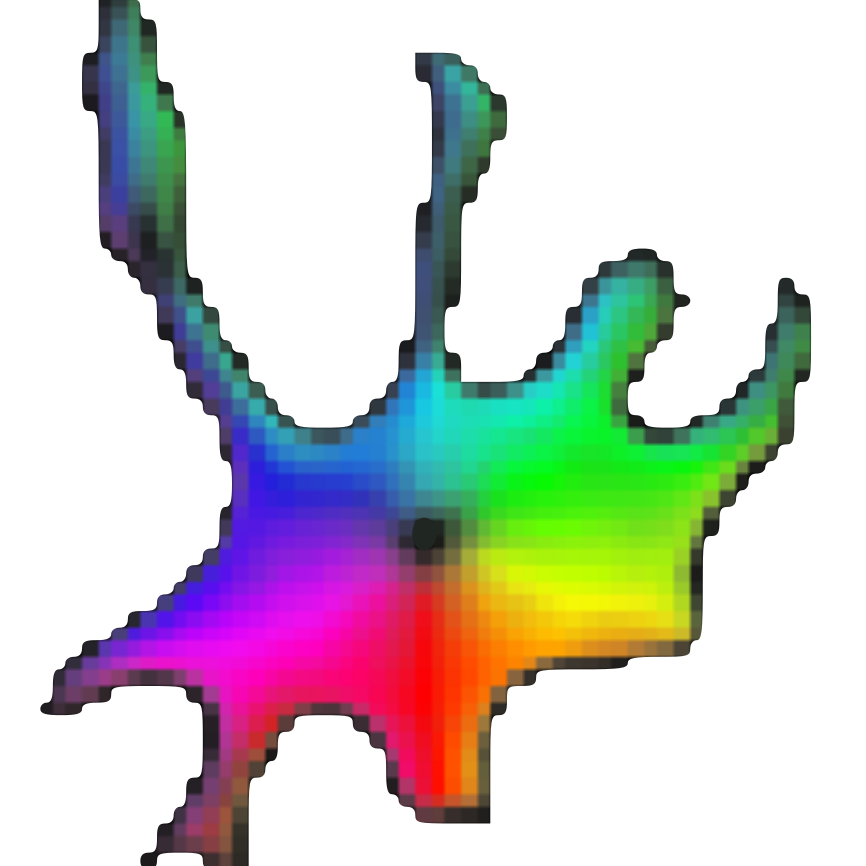

# Cellpose 

A generalist algorithm for cell and nucleus segmentation. 

This code was written by Carsen Stringer and Marius Pachitariu. To learn about Cellpose, read the [paper](https://t.co/4HFsxDezAP?amp=1) or watch the [talk](https://t.co/JChCsTD0SK?amp=1). For support, please open an [issue](https://github.com/MouseLand/cellpose/issues). 

You can quickly try out Cellpose on the [website](http://www.cellpose.org) first (some features disabled). If you want to improve Cellpose for yourself and for everyone else, please consider contributing manual segmentations for a few of your images via the built-in GUI interface (see instructions below). 

## Installation

We recommend installing an [Anaconda](https://www.anaconda.com/download/) distribution of Python -- Choose **Python 3.7** and your operating system. Note you might need to use an anaconda prompt if you did not add anaconda to the path. From your base environment (or you can make a new environment) in an anaconda prompt/command prompt, run
~~~~
pip install cellpose
~~~~

Alternatively you can use the included environment file (if you'd like a cellpose-specific environment). This is **recommended** if you have problems with the pip. Please follow these instructions:

1. Download the [`environment.yml`](https://github.com/MouseLand/cellpose/blob/master/environment.yml?raw=true) file from the repository. You can do this by cloning the repository, or copy-pasting the text from the file into a text document on your local computer.
2. Open an anaconda prompt / command prompt with `conda` for **python 3** in the path
3. Change directories to where the `environment.yml` is and run `conda env create -f environment.yml`
4. To activate this new environment, run `conda activate cellpose`
5. You should see `(cellpose)` on the left side of the terminal line. Now run `python -m cellpose` and you're all set.

To upgrade cellpose (package [here](https://pypi.org/project/cellpose/)), run the following in the environment:
~~~~
pip install cellpose --upgrade
~~~~

If you have an older `cellpose` environment you can remove it with `conda env remove -n cellpose` before creating a new one.

Note you will always have to run **conda activate cellpose** before you run cellpose. If you want to run jupyter notebooks in this environment, then also `conda install jupyter`.

**Common issues**

If you receive the error: `Illegal instruction (core dumped)`, then likely mxnet does not recognize your MKL version. Please uninstall and reinstall mxnet without mkl:
~~~~
pip uninstall mxnet-mkl
pip uninstall mxnet
pip install mxnet==1.4.0
~~~~

If you receive the error: `No module named PyQt5.sip`, then try uninstalling and reinstalling pyqt5
~~~~
pip uninstall pyqt5 pyqt5-tools
pip install pyqt5 pyqt5-tools pyqt5.sip
~~~~

If you receive an error associated with **matplotlib**, try upgrading it:
~~~~
pip install matplotlib --upgrade
~~~~

If you are on Yosemite Mac OS, PyQt doesn't work and you won't be able to use the graphical interface for cellpose. More recent versions of Mac OS are fine. The software has been heavily tested on Windows 10 and Ubuntu 18.04, and less well tested on Mac OS. Please post an issue if you have installation problems.

**CUDA version**

If you plan on running many images, you may want to install a GPU version of *mxnet*. I recommend using CUDA 10.0 or greater. Follow the instructions [here](https://mxnet.apache.org/get_started?).

Before installing the GPU version, remove the CPU version:
~~~
pip uninstall mxnet-mkl
pip uninstall mxnet
~~~

When upgrading cellpose, you will want to ignore dependencies (so that mxnet-mkl does not install):
~~~
pip install --no-deps cellpose --upgrade
~~~

**Installation of github version**

Follow steps from above to install the dependencies. In the github repository, run `pip install -e .` and the github version will be installed. If you want to go back to the pip version of cellpose, then say `pip install cellpose`.

## Running cellpose

The quickest way to start is to open the GUI from a command line terminal. You might need to open an anaconda prompt if you did not add anaconda to the path:
~~~~
python -m cellpose
~~~~

The first time cellpose runs it downloads the latest available trained model weights from the website.

You can now **drag and drop** any images (*.tif, *.png, *.jpg, *.gif) into the GUI and run Cellpose, and/or manually segment them. When the GUI is processing, you will see the progress bar fill up and during this time you cannot click on anything in the GUI. For more information about what the GUI is doing you can look at the terminal/prompt you opened the GUI with. For example data, See [website](http://www.cellpose.org). For best accuracy and runtime performance, resize images so cells are less than 100 pixels across. 

For multi-channel, multi-Z tiff's, the expected format is Z x channels x Ly x Lx.

## Contributing training data

We are very excited about receiving community contributions to the training data and re-training the cytoplasm model to make it better. Please follow these guidelines:

1. Run cellpose on your data to see how well it does. Try varying the diameter, which can change results a little. 
2. If there are relatively few mistakes, it won't help much to contribute labelled data. 
3. If there are consistent mistakes, your data is likely very different from anything in the training set, and you should expect major improvements from contributing even just a few manually segmented images.
4. For images that you contribute, the cells should be at least 10 pixels in diameter, and there should be **at least** several dozens of cells per image, ideally ~100. If your images are too small, consider combining multiple images into a single big one and then manually segmenting that. If they are too big, consider splitting them into smaller crops. 
5. For the manual segmentation, please try to outline the boundaries of the cell, so that everything (membrane, cytoplasm, nucleus) is inside the boundaries. Do not just outline the cytoplasm and exclude the membrane, because that would be inconsistent with our own labelling and we wouldn't be able to use that. 
6. Do not use the results of the algorithm in any way to do contributed manual segmentations. This can reinforce a vicious circle of mistakes, and compromise the dataset for further algorithm development. 

If you are having problems with the nucleus model, please open an issue before contributing data. Nucleus images are generally much less diverse, and we think the current training dataset already covers a very large set of modalities. 

## Using the GUI

The GUI serves two main functions:

1. Running the segmentation algorithm.
2. Manually labelling data.

Main GUI mouse controls (works in all views):

- Pan  = left-click  + drag  
- Zoom = scroll wheel
- Full view = double left-click
- Select mask = left-click on mask
- Delete mask = Ctrl + left-click
- Start draw mask = right-click
- End draw mask = right-click, or return to circle at beginning

Overlaps in masks are NOT allowed. If you draw a mask on top of another mask, it is cropped so that it doesn't overlap with the old mask. Masks in 2D should be single strokes (if single stroke is checked). 

!NOTE!: The GUI automatically saves after you draw a mask but NOT after segmentation. Save in the file menu or with Ctrl+S. The output file is in the same folder as the loaded image with `_seg.npy` appended.

| Keyboard shortcuts  | Description                                                                    |
| ------------------- | ------------------------------------------------------------------------------ |
| CTRL+H              | help                                                           |
| CTRL+Z              | undo previously drawn mask/stroke                              |
| CTRL+0              | clear all masks                                                |
| CTRL+L              | load image (can alternatively drag and drop image)             |
| CTRL+S              | SAVE MASKS IN IMAGE to `_seg.npy` file                      |
| CTRL+P              | load `_seg.npy` file (note: it will load automatically with image if it exists) |
| CTRL+M              | load masks file (must be same size as image with 0 for NO mask, and 1,2,3... for masks)|
| CTRL+N              | load numpy stack (NOT WORKING ATM)                             |
| A/D or LEFT/RIGHT   | cycle through images in current directory                      |
| W/S or UP/DOWN      | change color (RGB/gray/red/green/blue)                         |
| PAGE-UP / PAGE-DOWN | change to flows and cell prob views (if segmentation computed) |
| , / .               | increase / decrease brush size for drawing masks               |
| X                   | turn masks ON or OFF                                           |
| Z                   | toggle outlines ON or OFF                                      |
| C                   | cycle through labels for image type (saved to `_seg.npy`)   |

**Segmentation options**

SIZE: you can manually enter the approximate diameter for your cells, or press "calibrate" to let the model estimate it. The size is represented by a disk at the bottom of the view window (can turn this disk off by unchecking "scale disk on").

use GPU: if you have installed the cuda version of mxnet, then you can activate this, but it won't give huge speedups when running single images in the GUI.

MODEL: there is a *cytoplasm* model and a *nuclei* model, choose what you want to segment

CHAN TO SEG: this is the channel in which the cytoplasm or nuclei exist

CHAN2 (OPT): if *cytoplasm* model is chosen, then choose the nuclear channel for this option

### In a notebook

See [run_cellpose.ipynb](notebooks/run_cellpose.ipynb).

## Outputs

`*_seg.npy` files have the following fields:

- *filename* : filename of image
- *img* : image with chosen channels (Z x nchan x Ly x Lx)
- *masks* : masks (-1 = NO masks, 0,1,2,... = mask labels)
- *colors* : colors for masks
- *outlines* : outlines of masks (-1 = NO outline, 0,1,2,... = outline labels)
- *chan_choose* : channels that you chose in GUI (0=gray/none, 1=red, 2=green, 3=blue)
- *ismanual* : element *k* = whether or not mask *k* was manually drawn or computed by the cellpose algorithm

~~~~
import numpy as np
from cellpose import plot

dat = np.load('_seg.npy', allow_pickle=True).item()

# plot image with masks overlaid
RGB = plot.mask_overlay(dat['img'], dat['masks']+1,
                        colors=np.array(dat['colors']))

# plot image with outlines overlaid in red (can change color of outline)
RGB = plot.outline_overlay(dat['img'], dat['outlines']+1,
                           channels=dat['chan_choose'], color=[255,0,0])
~~~~~

## Dependencies
cellpose relies on the following excellent packages (which are automatically installed with conda/pip if missing):
- [mxnet_mkl](https://mxnet.apache.org/)
- [pyqtgraph](http://pyqtgraph.org/)
- [PyQt5](http://pyqt.sourceforge.net/Docs/PyQt5/)
- [numpy](http://www.numpy.org/) (>=1.16.0)
- [numba](http://numba.pydata.org/numba-doc/latest/user/5minguide.html)
- [scipy](https://www.scipy.org/)
- [scikit-image](https://scikit-image.org/)
- [natsort](https://natsort.readthedocs.io/en/master/)
- [matplotlib](https://matplotlib.org/)
