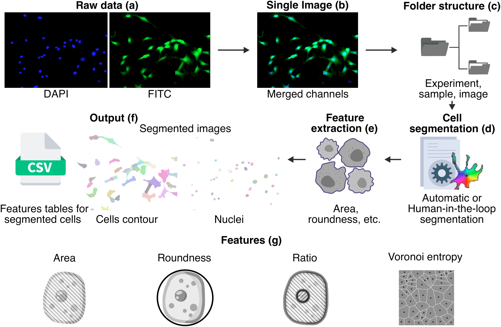
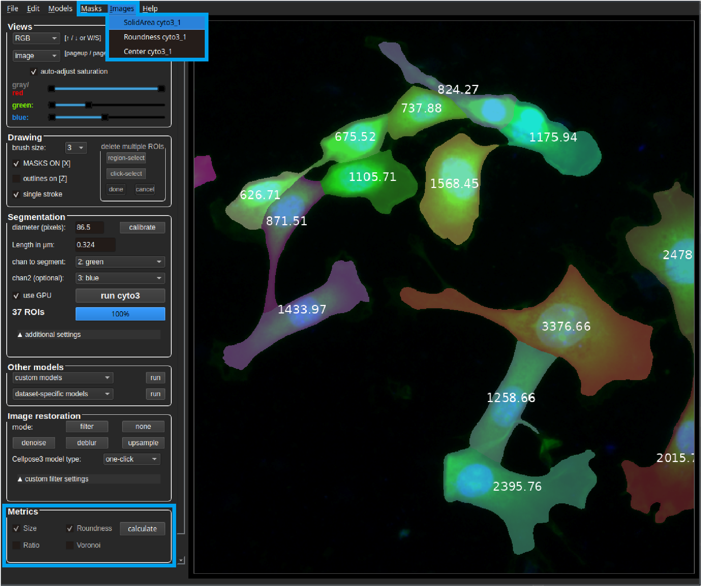

# 
  <b>Cellpose plus</b> 

<!--  -->

<!--  -->
<!--  -->

<!--  -->
<!--  -->

Cellpose plus is a morphological analysis tool that builds on a forked branch of the state-of-the-art image segmentation framework [Cellpose](https://github.com/MouseLand/cellpose). 
We add feature extraction algorithms to asses morphological properties of cells and nuclei. This way we achieve a single workflow to study stained cells, from raw images to labeled masks with their corresponding measures. \
As the main Cellpose branch continues to grow actively, we aim to keep our forked repository up to date. The latest additions and bug fixes are also present in our repository.

Developed by the InfoChemistry scientific center, part of ITMO University.

### Installation

We suggest installing our fork using `conda` and `pip` (with `python>=3.8`).

1. Install [Anaconda](https://www.anaconda.com/download/).
2. Open an `anaconda` prompt / command prompt which has conda for python 3 in the path.
3. For a new environment for CPU only, run:\
 `conda create -n cellpose_plus 'python==3.9' pytorch`
4. To activate the new environment, run `conda activate cellpose_plus`
5. For NVIDIA GPUs, run:\
 `pip install torch torchvision --index-url https://download.pytorch.org/whl/cu126` \
   If there are problems with the latest version, we suggest to install CUDA 11.8
6. To install the latest PyPi release of Cellpose plus and its dependencies (see [setup.py](https://github.com/ITMO-MMRM-lab/cellpose/blob/main/setup.py)), run:\
  `pip install cellpose-plus[gui]`\
  or `pip install cellpose-plus` for a version without GUI.

### System requirements

Linux, Windows and Mac OS are supported for running the code. For running the graphical interface you will need a Mac OS later than Yosemite. At least 8GB of RAM is required to run the software. 16GB-32GB may be required for larger images. The software has been tested on Windows 10, Windows 11, Ubuntu 24.04, Manjaro and limitedly tested on Mac OS.

### New features
As a novelty, we contribute with the addition of capabilities to calculate the following metrics:

* Area of subject (𝜇𝑚²).
* Roundness (0.0 - 1.0), having 1.0 for a perfect circle.
* Size ratio between each pair of cell and nucleus.
* Fraction of image covered by cells/nuclei.
* Relative center coordinates.
* Voronoi diagram based on the centers.
* Voronoi entropy, a measure of order/chaos in the cells' positions.
* Convex hull of all objects.
* Continuous symmetry measure (CSM). 

### General workflow

<!--  -->

In order to obtain metrics from segmented cells, the initial stained images are merged into a
single image and organized into sub folders to be processed. A cell segmentation
procedure is performed using [Cellpose](https://github.com/MouseLand/cellpose), then we extract the metrics 
and finally we store the results in the form of images and CSV files.

### Try out online!

You can run Cellpose plus in Google Colab with a GPU: 
* We provide a commented code-based example notebook:  showing each part of our workflow.

### How to use

Here we present a usage example:

<!--  -->

After the segmentation process, possibly including manual editing of the masks, we can save the masks in a folder with the same name as the image and place them in the same location by clicking the "Save labeled  mask" button. If we want to calculate metrics for the current segmentation, we can save it as a snapshot by clicking the "Save mask temporarily" button.

In the image below, we can see a saved snapshot from a mask calculated using a `cyto3` model. As it is the first snapshot from this model, the final snapshot name is `cyto3_1`.

Each snapshot should represent the segmentation of a subject type (cytoplasm or nuclei), to define this, we select one of the options pictured above (main or secondary mask). Here, we see an example of `cyto3_1` selected as the main mask and `nuclei_1` as the secondary mask.

At the bottom of the GUI, we find the metrics panel with the following options: \
Area and roundness are clickable when having a snapshot selected as primary. If there is a primary and a secondary snapshot available, the values are calculated separately per subject (cells and/or nuclei).
Ratio and Voronoi are clickable when having a primary and a secondary snapshot selected. To obtain results, both snapshots are necessary.

After clicking "calculate" it will take a few moments until we get a folder with the same name as the source image, containing the result values ​​in .csv and .png formats. For extra feedback about the processes and alerts, we suggest to stay pending of the python shell.

"primary" and "secondary" folders contain individual results per snapshot. For example: primary -> area and roundness of cells, secondary -> area and roundness of nuclei.

For features provided by the basic Cellpose, such as image restoration, segmentation settings and mask editing, we encourage you to read the original [Cellpose documentation](https://cellpose.readthedocs.io/en/latest/index.html).

### Citation

If you find our project helpful, use the following bibtex to reference our [paper](https://arxiv.org/abs/2410.18738).

~~~
@article{huaman2024cellpose+,
  title={Cellpose+, a morphological analysis tool for feature extraction of stained cell images},
  author={Huaman, Israel A and Ghorabe, Fares DE and Chumakova, Sofya S and Pisarenko, Alexandra A and Dudaev, Alexey E and Volova, Tatiana G and Ryltseva, Galina A and Ulasevich, Sviatlana A and Shishatskaya, Ekaterina I and Skorb, Ekaterina V and others},
  journal={arXiv preprint arXiv:2410.18738},
  year={2024}
}
~~~

As we work over Cellpose, we ask you to also cite the Cellpose [paper](https://t.co/kBMXmPp3Yn?amp=1).
