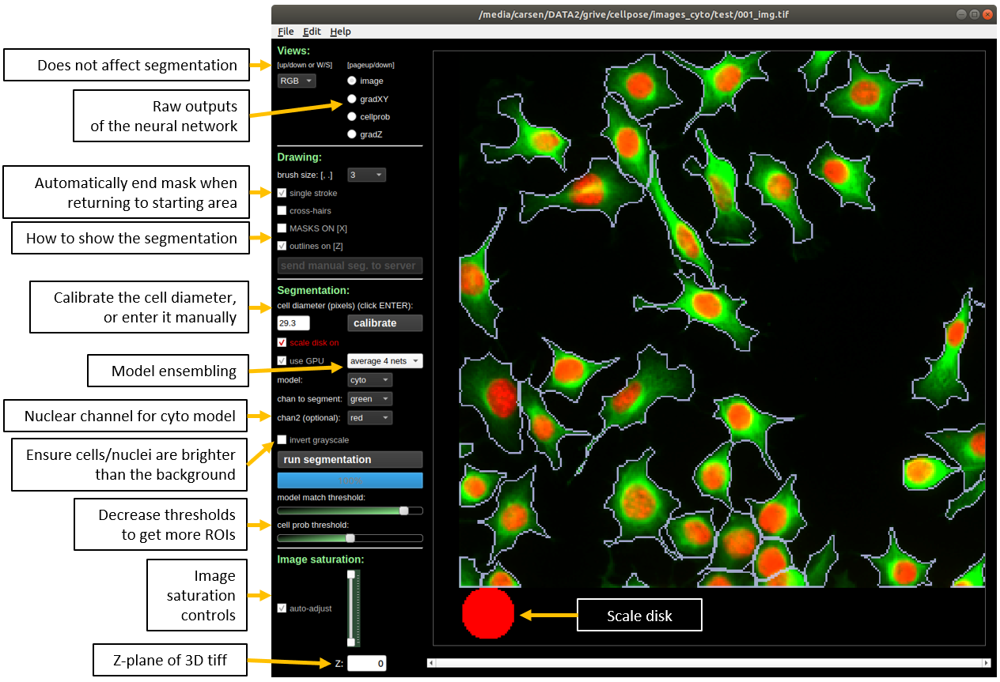

# 
  <b>Cellpose </b> 

A generalist algorithm for cell and nucleus segmentation. 

Cellpose was written by Carsen Stringer and Marius Pachitariu. To learn about Cellpose, read the [paper](https://t.co/kBMXmPp3Yn?amp=1) or watch the [talk](https://t.co/JChCsTD0SK?amp=1). For support, please open an [issue](https://github.com/MouseLand/cellpose/issues). If you use Cellpose in your work please cite the paper.

If you want to improve Cellpose for yourself and for everyone else, please consider contributing manual segmentations for a few of your images via the built-in GUI interface (see instructions below). 

### UPDATE v0.7 (Nov 2021)

[Omnipose](https://github.com/kevinjohncutler/omnipose) is now officially available and supported as part of Cellpose. `pip install omnipose` and use the 'omni' flag and models to take advantage of it for long cells! (<i>E.g.</i>, filamentous bacteria.) Omnipose was written by Kevin Cutler ([@kevinjohncutler](https://github.com/kevinjohncutler)). To learn about Omnipose, read the [paper](http://biorxiv.org/content/early/2021/11/04/2021.11.03.467199). If you use Omnipose in your work please cite the Cellpose paper and the Omnipose paper.

### UPDATE v0.6 (Dec 2020)

Pytorch is now the default deep neural network software for cellpose. Mxnet will still be supported. To install mxnet (CPU), run `pip install mxnet-mkl`. To use mxnet in a notebook, declare `torch=False` when creating a model, e.g. `model = models.Cellpose(torch=False)`. To use mxnet on the command line, add the flag `--mxnet`, e.g. `python -m cellpose --dir ~/images/ --mxnet`. The pytorch implementation is 20% faster than the mxnet implementation when running on the GPU and 20% slower when running on the CPU. 

Dynamics are computed using bilinear interpolation by default instead of nearest neighbor interpolation. Set `interp=False` in `model.eval` to turn off. The bilinear interpolation will be slightly slower on the CPU, but it is faster than nearest neighbor if using torch and the GPU is enabled.

### Run cellpose without local python installation

You can quickly try out Cellpose on the [website](https://www.cellpose.org) first (some features disabled). 

You can also run Cellpose in google colab with a GPU: 
* a code-based notebook: 
* a more user-friendly notebook for 2D segmentation written by [@pr4deepr](https://github.com/pr4deepr): 
* a user-friendly [ZeroCostDL4Mic](https://github.com/HenriquesLab/ZeroCostDL4Mic) notebook that includes training cellpose models, written by [@guijacquemet](https://github.com/guijacquemet): 

The colab notebooks are recommended if you have issues with MKL or run speed on your local computer (and are running 3D volumes). Colab does not allow you to run the GUI, but you can save `*_seg.npy` files in colab that you can download and open in the GUI.

**Executable file**: You can download an executable file for [*Windows 10*](http://www.cellpose.org/windows) or for [*Mac OS*](http://www.cellpose.org/mac) (High Sierra or greater) that were made using PyInstaller on Intel processors (MKL acceleration works, but no GPU support). Note in both cases it will take a few seconds to open.

* The [*Mac OS*](https://www.cellpose.org/mac) file will download as `cellpose_mac` OR `cellpose_mac.dms`. You will need to make it into an executable file and run it through the terminal:
1. Open a terminal and run `cd ~/Downloads/`.
2. Run `chmod 777 cellpose_mac` OR `chmod 777 cellpose_mac.dms` to make the file executable.
3. Run `./cellpose_mac` OR `./cellpose_mac.dms` to open the cellpose GUI. Messages from cellpose will be printed in the terminal.
4. You can also run using the command line interface, e.g. as `./cellpose_mac --dir ~/Pictures/ --chan 2 --save_png`.

* The [*Windows 10*](https://www.cellpose.org/windows) file is an exe and you can click on it to run the GUI. You can also run using the command line interface, e.g. as `cellpose.exe --dir Pictures/ --chan 2 --save_png`

### Detailed documentation at [www.cellpose.org/docs](http://www.cellpose.org/docs).

## System requirements

Linux, Windows and Mac OS are supported for running the code. For running the graphical interface you will need a Mac OS later than Yosemite. At least 8GB of RAM is required to run the software. 16GB-32GB may be required for larger images and 3D volumes. The software has been heavily tested on Windows 10 and Ubuntu 18.04 and less well-tested on Mac OS. Please open an issue if you have problems with installation.

## Local installation

If you have an older `cellpose` environment you can remove it with `conda env remove -n cellpose` before creating a new one.

If you are using a GPU, make sure its drivers and the cuda libraries are correctly installed.

1. Install an [Anaconda](https://www.anaconda.com/download/) distribution of Python -- Choose **Python 3.8** and your operating system. Note you might need to use an anaconda prompt if you did not add anaconda to the path.
2. Open an anaconda prompt / command prompt with `conda` for **python 3** in the path
3. Create a new environment with `conda create --name cellpose python=3.8`.
4. To activate this new environment, run `conda activate cellpose`
5. To install the minimal version of cellpose, run `python -m pip install cellpose`.  
6. To install cellpose, omnipose and the GUI, run `python -m pip install cellpose[all]`. If you're on a zsh server, you may need to use ' ' around the cellpose[all] call: `python -m pip install 'cellpose[all]'.

To upgrade cellpose (package [here](https://pypi.org/project/cellpose/)), run the following in the environment:

~~~sh
python -m pip install cellpose --upgrade
~~~

Note you will always have to run `conda activate cellpose` before you run cellpose. If you want to run jupyter notebooks in this environment, then also `conda install jupyter` and `python -m pip install matplotlib`.

You can also try to install cellpose, omnipose and the GUI dependencies from your base environment using the command

~~~~sh
python -m pip install cellpose[all]
~~~~

If you have **issues** with installation, see the [docs](https://cellpose.readthedocs.io/en/latest/installation.html) for more details. You can also use the cellpose environment file included in the repository and create a cellpose environment with `conda env create -f environment.yml` which may solve certain dependency issues.

If these suggestions fail, open an issue.

### GPU version (CUDA) on Windows or Linux

If you plan on running many images, you may want to install a GPU version of *torch* (if it isn't already installed).

Before installing the GPU version, remove the CPU version:
~~~
pip uninstall torch
~~~

Follow the instructions [here](https://pytorch.org/get-started/locally/) to determine what version to install. The Anaconda install is strongly recommended, and then choose the CUDA version that is supported by your GPU (newer GPUs may need newer CUDA versions > 10.2). For instance this command will install the 10.2 version on Linux and Windows (note the `torchvision` and `torchaudio` commands are removed because cellpose doesn't require them):

~~~
conda install pytorch cudatoolkit=10.2 -c pytorch
~~~~

For the GPU version of mxnet, you will need to install the cuda toolkit first if you haven't already (on Windows it may be necessary to install via anaconda as below):

~~~
conda install -c anaconda cudatoolkit
~~~

When upgrading GPU Cellpose in the future, you will want to ignore dependencies (to ensure that the pip version of torch does not install):
~~~
pip install --no-deps cellpose --upgrade
~~~

### Installation of github version

Follow steps from above to install the dependencies. Then run 
~~~
pip install git+https://www.github.com/mouseland/cellpose.git
~~~

If you want edit ability to the code, in the github repository folder, run `pip install -e .`. If you want to go back to the pip version of cellpose, then say `pip install cellpose`.

### Download of pretrained models

The models will be downloaded automatically from the [website](https://www.cellpose.org) when you first run a pretrained model in cellpose. If you are having issues with the downloads, you can download them from this [google drive zip file](https://drive.google.com/file/d/1mK8aJDg0jv6s9Vc_5HntpUPmC--p2fE0/view?usp=sharing), unzip the file and put the models in your home directory under the path .cellpose/models/, e.g. on Windows this would be C:/Users/YOUR_USERNAME/.cellpose/models/ or on Linux this would be /home/YOUR_USERNAME/.cellpose/models/, so /home/YOUR_USERNAME/.cellpose/models/cyto_0 is the full path to one model for example. If you cannot access google drive, the models are also available on baidu: Link：https://pan.baidu.com/s/1CARpRGCBHIYaz7KeyoX-fg ; Fetch code：pose ; thanks to @qixinbo!

## Running cellpose

The quickest way to start is to open the GUI from a command line terminal. You might need to open an anaconda prompt if you did not add anaconda to the path:
~~~~
python -m cellpose
~~~~

The first time cellpose runs it downloads the latest available trained model weights from the website.

You can now **drag and drop** any images (*.tif, *.png, *.jpg, *.gif) into the GUI and run Cellpose, and/or manually segment them. When the GUI is processing, you will see the progress bar fill up and during this time you cannot click on anything in the GUI. For more information about what the GUI is doing you can look at the terminal/prompt you opened the GUI with. For example data, see [website](http://www.cellpose.org) or this google drive [folder](https://drive.google.com/open?id=18syVlaix8cIlrnNF20pEWKMWUsKx9R9z). For best accuracy and runtime performance, resize images so cells are less than 100 pixels across. 

### Step-by-step demo

1. Download the google drive [folder](https://drive.google.com/open?id=18syVlaix8cIlrnNF20pEWKMWUsKx9R9z) and unzip it. These are a subset of the test images from the paper.
2. Start the GUI with `python -m cellpose`.
3. Drag an image from the folder into the GUI.
4. Set the model (in demo all are `cyto`) and the channel you want to segment (in demo all are `green`). Optionally set the second channel if you are segmenting `cyto` and have an available nucleus channel.
5. Click the `calibrate` button to estimate the size of the objects in the image. Alternatively you can set the `cell diameter` by hand and press ENTER. You will see the size you set as a red disk at the bottom left of the image.
6. Click the `run segmentation` button. If MASKS ON is checked, you should see masks drawn on the image.
7. Now you can click the LEFT/RIGHT arrow keys to move through the folder and segment another image.

On the demo images each of these steps should run in less than a few seconds on a standard laptop or desktop (with mkl working).

### 3D segmentation

For multi-channel, multi-Z tiff's, the expected format is Z x channels x Ly x Lx.

## Contributing training data

We are very excited about receiving community contributions to the training data and re-training the cytoplasm model to make it better. Please follow these guidelines:

1. Run cellpose on your data to see how well it does. Try varying the diameter, which can change results a little. 
2. If there are relatively few mistakes, it won't help much to contribute labelled data. 
3. If there are consistent mistakes, your data is likely very different from anything in the training set, and you should expect major improvements from contributing even just a few manually segmented images.
4. For images that you contribute, the cells should be at least 10 pixels in diameter, and there should be **at least** several dozens of cells per image, ideally ~100. If your images are too small, consider combining multiple images into a single big one and then manually segmenting that. If they are too big, consider splitting them into smaller crops. 
5. For the manual segmentation, please try to outline the boundaries of the cell, so that everything (membrane, cytoplasm, nucleus) is inside the boundaries. Do not just outline the cytoplasm and exclude the membrane, because that would be inconsistent with our own labelling and we wouldn't be able to use that. 
6. Do not use the results of the algorithm in any way to do contributed manual segmentations. This can reinforce a vicious circle of mistakes, and compromise the dataset for further algorithm development. 

If you are having problems with the nucleus model, please open an issue before contributing data. Nucleus images are generally much less diverse, and we think the current training dataset already covers a very large set of modalities. 

## Using the GUI

The GUI serves two main functions:

1. Running the segmentation algorithm.
2. Manually labelling data.

There is a help window in the GUI that provides more instructions and 
a page in the documentation [here](http://cellpose.readthedocs.io/en/latest/gui.html).
Also, if you hover over certain words in the GUI, their definitions are revealed as tooltips. 
Here is a summary of their functions:

### In a notebook

See [run_cellpose.ipynb](notebooks/run_cellpose.ipynb).

### From the command line

Run `python -m cellpose` and specify parameters as below. For instance to run on a folder with images where cytoplasm is green and nucleus is blue and save the output as a png:
~~~
python -m cellpose --dir ~/images_cyto/test/ --pretrained_model cyto --chan 2 --chan2 3 --save_png
~~~

You can specify the diameter for all the images or set to 0 if you want the algorithm to estimate it on an image by image basis. Here is how to run on nuclear data (grayscale) where the diameter is automatically estimated:
~~~
python -m cellpose --dir ~/images_nuclei/test/ --pretrained_model nuclei --diameter 0. --save_png
~~~

See the [docs](http://cellpose.readthedocs.io/en/latest/command.html) for more info.

### Timing

You can check if cellpose is running the MKL version (if you are using the CPU not the GPU) by adding the flag `--check_mkl`. If you are not using MKL cellpose will be much slower. Here are Cellpose run times divided into the time it takes to run the deep neural network (DNN) and the time for postprocessing (gradient tracking, segmentation, quality control etc.). The DNN runtime is shown using either a GPU (Nvidia GTX 1080Ti) or a CPU (Intel 10-core 7900X), with or without network ensembling (4net vs 1net). The postprocessing runtime is similar regardless of ensembling or CPU/GPU version. Runtime is shown for different image sizes, all with a cell diameter of 30 pixels (the average from our training set).

|   | 256 pix | 512 pix | 1024 pix |
|----|-------|------|----------|
| DNN (1net, GPU) | 0.054 s | 0.12 s | 0.31 s  |
| DNN (1net, CPU) | 0.30 s | 0.65 s | 2.4 s  |
| DNN (4net, GPU) | 0.23 s | 0.41 s | 1.3 s |
| DNN (4net, CPU) | 1.3 s | 2.5 s | 9.1 s  |
|  | |  |  |
| Postprocessing (CPU) | 0.32 s | 1.2 s | 6.1 s  |

## Outputs

See the [docs](http://cellpose.readthedocs.io/en/latest/outputs.html) for info.

## Dependencies
cellpose relies on the following excellent packages (which are automatically installed with conda/pip if missing):
- [mxnet_mkl](https://mxnet.apache.org/)
- [pyqtgraph](http://pyqtgraph.org/)
- [PyQt5](http://pyqt.sourceforge.net/Docs/PyQt5/)
- [numpy](http://www.numpy.org/) (>=1.16.0)
- [numba](http://numba.pydata.org/numba-doc/latest/user/5minguide.html)
- [scipy](https://www.scipy.org/)
- [natsort](https://natsort.readthedocs.io/en/master/)
