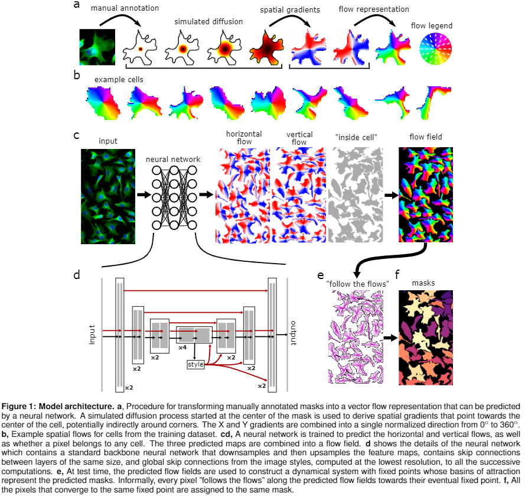

.. cellpose master

cellpose
===================================

cellpose is an anatomical segmentation algorithm written in Python 3 
by Carsen Stringer and Marius Pachitariu. For support, please open 
an `issue`_.

We make pip installable releases of cellpose, here is the `pypi`_. You
can install it as ``pip install cellpose[gui]``.

You can try it out without installing at `cellpose.org`_. 
Also check out these resources:

- twitter `thread`_
- Marius's `talk`_ on cellpose
- `paper`_ on biorxiv (see figure 1 below)

.. _cellpose.org: http://www.cellpose.org
.. _thread: https://twitter.com/computingnature/status/1224477812763119617
.. _issue: https://github.com/MouseLand/cellpose/issues
.. _paper: https://www.biorxiv.org/content/10.1101/2020.02.02.931238v1
.. _talk: https://www.youtube.com/watch?v=7y9d4VIKiS8
.. _pypi: https://pypi.org/project/cellpose/

.. toctree::
   :maxdepth: 3
   :caption: Basics:

   installation
   gui
   inputs
   settings
   outputs
   train
   

.. toctree::
   :maxdepth: 3
   :caption: Examples:

   notebook
   command
   

.. toctree::
   :caption: API Reference:

   api