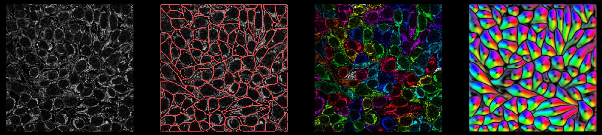

Outputs
-------------------------

in a notebook 
~~~~~~~~~~~~~~~~~~~~~~~~~~~~~

when you run

::
    
    from cellpose import io, models
    img = io.imread("img.tif")
    masks, flows, styles = models.CellposeModel(model_type='tissuenet_cp3').eval(img, 
                                diameter=25, channels=[1,2])

Internally, the network predicts 3 (or 4) outputs: 
(flows in Z), flows in Y, flows in X, and cellprob. 
The predictions the network makes of cellprob are used as inputs to a sigmoid 
centered at zero (1 / (1 + e^-x)) in the loss function (binary cross-entropy loss), 
so they vary from around -10 to +10. These are 
output from the `eval` function as the second variable flows. The Y flows and X flows are used 
to simulate a dynamical system on the pixels, which is run on only pixels with a 
``cellprob > cellprob_threshold``. All pixels which converge to the same point are assigned the same 
label in the *masks* output, of size (Lz x) Ly x Lx (0 = NO ROI; 1,2,... = ROI labels).
The styles are the sum over pixels of the output of the last downsampling layer of the network.

Cellpose also produces various outputs from the command line and the GUI, which are 
described below:

_seg.npy output 
~~~~~~~~~~~~~~~~~~~~~~~~~~~~~~~~

``*_seg.npy`` files have the following fields:

- *filename* : filename of image
- *masks* : each pixel in the image is assigned to an ROI (0 = NO ROI; 1,2,... = ROI labels)
- *outlines* : outlines of ROIs (0 = NO outline; 1,2,... = outline labels)
- *chan_choose* : channels that you chose in GUI (0=gray/none, 1=red, 2=green, 3=blue)
- *ismanual* : element *k* = whether or not mask *k* was manually drawn or computed by the cellpose algorithm
- *flows* : 
    - flows[0] is XY flow in RGB
    - flows[1] is the cell probability in range 0-255 instead of -10.0 to 10.0
    - flows[2] is Z flow in range 0-255 (if it exists, otherwise zeros), 
    - flows[3] is [dY, dX, cellprob] (or [dZ, dY, dX, cellprob] for 3D), flows[4] is pixel destinations (for internal use)
- *est_diam* : estimated diameter / diameter used
- *zdraw* : for each mask, which planes were manually labelled (planes in between manually drawn have interpolated ROIs)

Note: the 'img' is no longer saved in the ``*_seg.npy`` file to save time.

Here is an example of loading in a ``*_seg.npy`` file and plotting masks and outlines

::

    import numpy as np
    from cellpose import plot, utils, io
    dat = np.load('_seg.npy', allow_pickle=True).item()
    img = io.imread('img.tif')

    # plot image with masks overlaid
    mask_RGB = plot.mask_overlay(img, dat['masks'],
                            colors=np.array(dat['colors']))

    # plot image with outlines overlaid in red
    outlines = utils.outlines_list(dat['masks'])
    plt.imshow(img)
    for o in outlines:
        plt.plot(o[:,0], o[:,1], color='r')

If you run in a notebook and want to save to a `*_seg.npy` file, run 

::

    from cellpose import io
    io.masks_flows_to_seg(images, masks, flows, file_name, channels=channels, diams=diams)

where each of these inputs is a list (as the output of `model.eval` is)

PNG output
~~~~~~~~~~~~~~~~~~~~~~~~~~~

You can save masks to PNG in the GUI.

To save masks (and other plots in PNG) using the command line, add the flag ``--save_png``.

Or use the function below if running in a notebook

::

    from cellpose import io
    io.save_masks(images, masks, flows, image_names, png=True)

Native ImageJ ROI archive output
~~~~~~~~~~~~~~~~~~~~~~~~~~~~~~~~~~~~~~~~~~~~~
You can save the outlines of the ROIs in a ImageJ-native ROI archive file. Rather than using the legacy solution below,
you can use this function to create an ROI archive file that can be opened in directly in ImageJ. Recent versions of
ImageJ can autodetect the file format. Open in ImageJ using File > Open... and select the file.
The ROIs will appear in the ROI manager.

To save the outlines using the CLI use the flag ``--save_rois``.

To save the outlines using the API use the ``save_rois`` function in ``io.py``:

This function is also available in the GUI.

::

    from cellpose import io, utils

    # image_name is file name of image
    # masks is numpy array of masks for image
    io.save_rois(masks, '<your_filename_string>')

    # the file will be saved as '<your_filename_string>_rois.zip'

(Legacy ImageJ Interface) ROI manager compatible output for ImageJ
~~~~~~~~~~~~~~~~~~~~~~~~~~~~~~~~~~~~~~~~~~~~~~~~~~~~~~~~~~~~~~~~~~~~~~~

You can save the outlines of ROIs in a text file that's compatible with ImageJ 
ROI Manager in the GUI File menu.

To save using the command line, add the flag ``--save_outlines``.

Or use the function below if running in a notebook

::

    from cellpose import io, utils

    # image_name is file name of image 
    # masks is numpy array of masks for image
    base = os.path.splitext(image_name)[0]
    outlines = utils.outlines_list(masks)
    io.outlines_to_text(base, outlines)
    
To load this ``_cp_outlines.txt`` file into ImageJ, use the python script 
provided in cellpose: ``imagej_roi_converter.py``. Run this as a macro after 
opening your image file. It will ask you to input the path to the ``_cp_outlines.txt`` 
file. Input that and the ROIs will appear in the ROI manager.

.. image:: _static/cellpose_to_imagej.gif
    :width: 600px
    :align: center
    :alt: cellpose to imagej

Plotting functions
~~~~~~~~~~~~~~~~~~~~~~~~~~~~

In ``plot.py`` there are functions, like ``show_segmentation``:

::

    from cellpose import plot

    nimg = len(imgs)
    for idx in range(nimg):
        maski = masks[idx]
        flowi = flows[idx][0]

        fig = plt.figure(figsize=(12,5))
        plot.show_segmentation(fig, imgs[idx], maski, flowi, channels=channels[idx])
        plt.tight_layout()
        plt.show()

